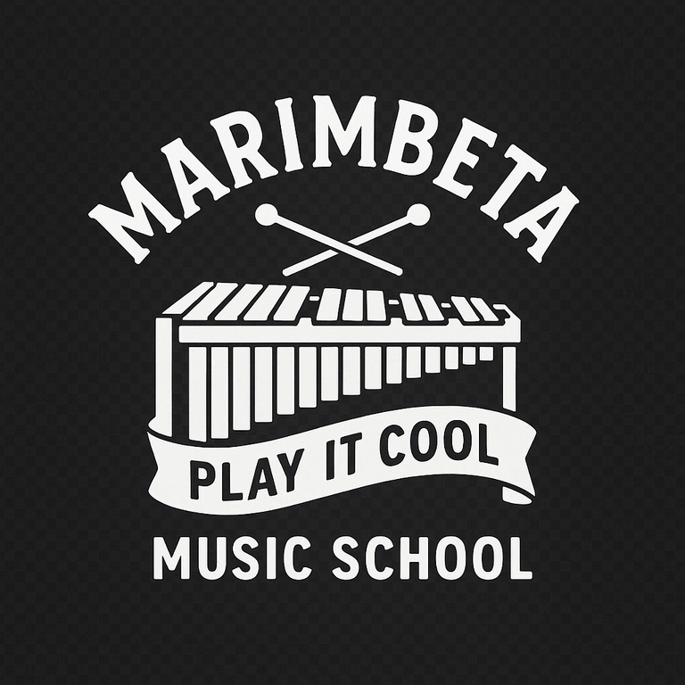
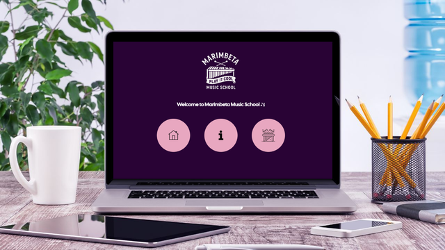
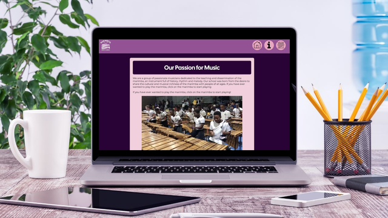
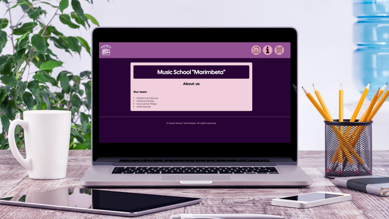

# 🎶 Marimbeta Music School - Interactive Music Experience
<div align="center">
</div>

This project is designed to provide an engaging and interactive platform for learning and playing the marimba. Users can explore the instrument through a virtual interface, enhancing their musical skills and creativity. Marimbeta Music School is a vibrant and creative space dedicated to teaching and celebrating the art of playing the marimba. Our mission is to share the cultural and musical richness of this unique instrument with people of all ages. Whether you're a beginner or an experienced musician, Marimbeta offers a welcoming environment to explore the rhythm, melody, and history of the marimba.

## 🛠️ Features
The Marimbeta platform offers the following features:

- **Interactive Marimba:** Users can play the marimba by clicking on virtual keys or using their keyboard. Each key corresponds to a specific note, creating an immersive musical experience.

- **Navigation:** Easy access to different sections of the platform, including the home page, about us page, and the interactive play page.

- **Audio Feedback:** Real-time audio feedback for each note played, providing an authentic marimba sound.

- **Hover Effects:** Interactive hover effects on buttons and icons for an enhanced user experience.

## 🖼️ Views and Screenshots
Here are some screenshots showcasing the different views of the Marimbeta Music School platform:

### 📑 Navigation Menu
The navigation menu ensures easy access to all sections of the platform.
<div align="center">

</div>

### 🎵 Home Page
The welcoming home page introduces users to the Marimbeta Music School and provides navigation to other sections.
<div align="center">

</div>

### 📖 About Us
The about page provides information about the mission and vision of Marimbeta Music School.
<div align="center">

</div>

### 🎹 Interactive Marimba
The interactive marimba view allows users to play the instrument virtually, with real-time audio feedback.
<div align="center">

</div>

## ⚙️ Stack
  

## 🌍 Deployment
The Marimbeta Music School platform is deployed and accessible online. Follow these steps to access the live version:

1. Open your browser and navigate to the following URL:  
[Marimbeta Music School Live](https://marimbaTeam.github.io/toquenElDom/)

2. Explore the interactive marimba and other features directly from your device.

For local deployment, refer to the **Local Installation** section below.

## 🧑‍💻 Local Installation

### 1. Clone this repository
```bash
git clone https://github.com/More-Pe/toquenElDom.git
```
### 2. Navigate to the project directory
```bash
cd toquenElDom
```
### 3. Run the project using Docker
Ensure you have Docker installed on your machine. Then, build and run the container:
```bash
docker build -t marimba-Project
docker run -d -p 8080:80 --name marimba-project-container marimba-Project
```
### 4. Access the application
Open your browser and navigate to http://localhost:8080 to explore the Marimbeta Music School platform.

## 📂 Project Structure
- HTML: Provides the structure for the pages, including index.html, home.html, about.html, and play.html.
- CSS: Styles the application with responsive and visually appealing designs.
- JavaScript: Adds interactivity to the marimba keys and handles audio playback.

## 🚀 Future Enhancements
We plan to expand the Marimbeta Music School platform with the following features:

- A **fully responsive** website optimized for both mobile and desktop devices.

- A **"Getting Started"** documentation section, guiding users through the basics.

- **Video tutorials** for learning how to play the marimba.

- **Song tutorials** with notes for the instrument, showcasing simple songs that can be played live.

### 👥 Team Members
- [Ana Carina Pillajo](https://github.com/acpp2510)  
- [Mayleris Echezuria](https://github.com/May1704)  
- [Morena Peralta](https://github.com/More-Pe)
- [Sofía Santos](https://github.com/sofianutria)
